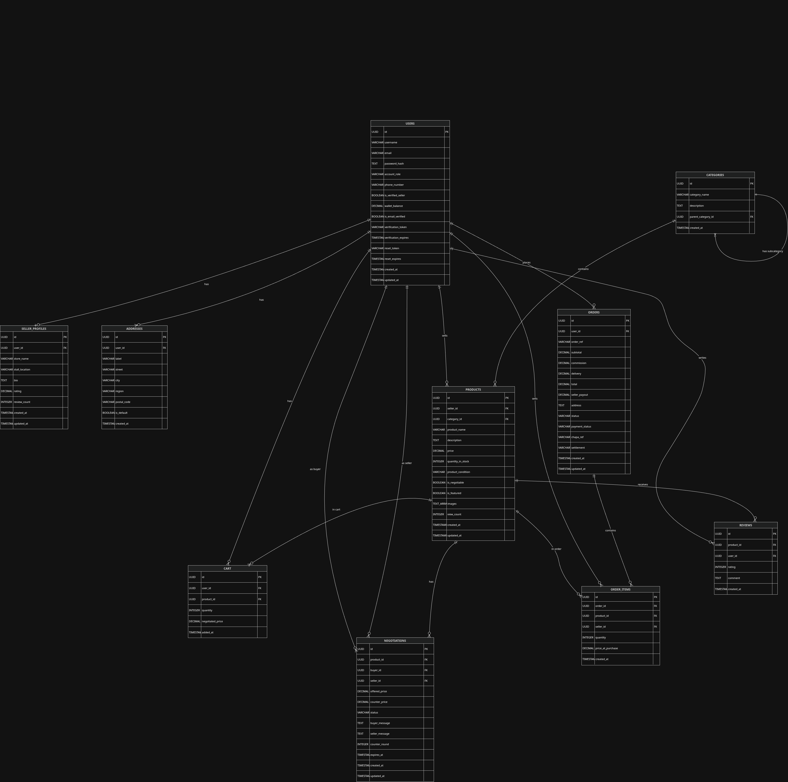

# E-Gulit Bazaar

Multi-vendor marketplace with built-in price negotiation, Chapa payment, and seller dashboards.

---

## What it does

Buyers can browse products, negotiate prices with sellers, pay via Chapa, and track orders. Sellers get a dashboard to manage listings and fulfill orders. Admins have a separate panel to manage users and products.

---

## Tech Stack

- **Backend:** Node.js, Express, PostgreSQL
- **Frontend:** React, React Router
- **Auth:** JWT (access + refresh tokens)
- **Payment:** Chapa API
- **Storage:** Multer for image uploads
- **Email:** Nodemailer (SMTP)
- **Logging:** Winston, Morgan

---

## Quick Start

### Requirements

- Node.js v18+
- PostgreSQL v14+
- npm

### Clone

```bash
git clone https://github.com/ZeroCool-1988/E-Gulit.git
cd e-gulit-bazaar
```

### Backend Setup

```bash
cd backend
cp .env.example .env
npm install
```

Edit `.env` with your database credentials and API keys.

```bash
npm run db:setup   # creates tables
npm run db:seed    # inserts test data
npm run dev        # starts server on port 3000
```

### Frontend Setup

```bash
cd frontend
cp .env.example .env
npm install
npm run dev        # starts on port 5173
```

---

## Environment Variables

### Backend `.env`

```env
PORT=3000
NODE_ENV=development

DB_HOST=localhost
DB_PORT=5432
DB_NAME=e_gulit_db
DB_USER=postgres
DB_PASSWORD=your_password

JWT_ACCESS_SECRET=your_access_secret
JWT_REFRESH_SECRET=your_refresh_secret
JWT_ACCESS_EXPIRY=15m
JWT_REFRESH_EXPIRY=7d

APP_URL=http://localhost:5173
BACKEND_URL=http://localhost:3000

SMTP_HOST=smtp.gmail.com
SMTP_PORT=587
SMTP_USER=your_email@gmail.com
SMTP_PASS=your_app_password
SMTP_FROM=E-Gulit <your_email@gmail.com>

CHAPA_API_KEY=your_chapa_test_key
CHAPA_API_URL=https://api.chapa.co/v1
```

### Frontend `.env`

```env
VITE_API_URL=http://localhost:3000/api
```

---
## Database Schema

ER-Diagram as PNG



The schema includes 10 tables:
- users — authentication, roles, wallet
- seller_profiles — store info, rating
- addresses — shipping addresses
- categories — product categories
- products — listings with images and stock
- cart — active cart items
- negotiations — price negotiation threads
- orders — order records
- order_items — items inside orders
- reviews — product ratings and comments

DDL is in `backend/database/schema.sql`.
---

## Test Accounts

All passwords are `password123`.

| Role   | Email               |
|--------|----------------------|
| Admin  | admin@egulit.com     |
| Seller | abebe@egulit.com     |
| Seller | hanna@egulit.com     |
| Seller | samuel@egulit.com    |
| Seller | tigist@egulit.com    |
| Buyer  | ermias@egulit.com    |
| Buyer  | sara@egulit.com      |
| Buyer  | dawit@egulit.com     |
| Buyer  | meron@egulit.com     |

---

## Project Structure

```text
e-gulit-bazaar/
├── backend/
│   ├── src/
│   │   ├── config/         # DB, logger, rate limiter
│   │   ├── models/         # SQL queries
│   │   ├── controllers/    # Business logic
│   │   ├── routes/         # API endpoints
│   │   ├── middleware/     # Auth, validation
│   │   ├── services/       # Chapa, email
│   │   └── utils/          # JWT, bcrypt
│   ├── database/
│   │   ├── schema.sql
│   │   └── seed.js
│   └── .env.example
└── frontend/
    ├── src/
    │   ├── api/            # API client
    │   ├── pages/          # React pages
    │   ├── components/     # Reusable UI
    │   └── styles/         # CSS files
    └── .env.example
```

---

## Features

### Authentication
- Register, login, logout
- Email verification
- Password reset
- JWT with refresh tokens

### Products
- Browse, search, filter by category and price
- Product detail with image gallery
- Negotiation (make offers, counter, accept/reject)
- Reviews and ratings

### Shopping
- Cart management
- Checkout with Chapa payment
- Order tracking (pending → paid → processing → shipped → delivered)
- Delivery confirmation by buyer

### Seller Dashboard
- Manage products (CRUD with images)
- View incoming orders
- Update order status
- Wallet balance

### Admin Panel
- Separate login
- View users, products, orders
- Verify sellers
- Delete products
- Platform stats

---

## API Endpoints

| Method | Endpoint                       | Description                  |
|--------|---------------------------------|-------------------------------|
| POST   | `/auth/register`               | Register user                 |
| POST   | `/auth/login`                  | Login                         |
| GET    | `/auth/profile`                | Get user profile              |
| POST   | `/auth/refresh`                | Refresh token                 |
| GET    | `/products`                    | List products                 |
| GET    | `/products/:id`                | Product detail                |
| POST   | `/products`                    | Create product (seller)       |
| PUT    | `/products/:id`                | Update product (seller)       |
| DELETE | `/products/:id`                | Delete product (seller/admin) |
| GET    | `/cart`                        | Get cart                      |
| POST   | `/cart`                        | Add to cart                   |
| PUT    | `/cart/:id`                    | Update quantity               |
| DELETE | `/cart/:id`                    | Remove from cart              |
| POST   | `/orders/checkout`             | Place order                   |
| GET    | `/orders`                      | Get orders                    |
| GET    | `/orders/:id`                  | Order detail                  |
| POST   | `/negotiations`                | Create offer                  |
| PUT    | `/negotiations/:id/respond`    | Accept/counter/reject         |
| GET    | `/reviews/product/:id`         | Get reviews                   |
| POST   | `/reviews`                     | Create review (buyer)         |
| GET    | `/admin/users`                 | List users (admin)            |
| PATCH  | `/admin/users/:id/verify`      | Verify seller (admin)         |
| DELETE | `/admin/products/:id`          | Delete product (admin)        |

---

## Extra Features (Beyond Course Scope)

| Feature             | Description                          |
|----------------------|---------------------------------------|
| Refresh tokens       | Longer sessions, better security      |
| Email verification   | Confirms email before full access     |
| Chapa payment        | Real payment integration              |
| File uploads         | Product images with validation        |
| Rate limiting        | Prevents brute force attacks          |
| Role-based access    | Buyer, seller, admin permissions      |
| Negotiation system   | 3-round price bargaining              |
| Order tracking       | Status updates + delivery confirmation|
| Seller wallet        | Balance tracking for sellers          |

---

## Deployment

### Backend
1. Set up a PostgreSQL database on your hosting provider.
2. Set environment variables in your hosting platform.
3. Run `npm start`.

### Frontend
1. Build: `npm run build`
2. Deploy the `dist` folder to Netlify, Vercel, or your hosting provider.
